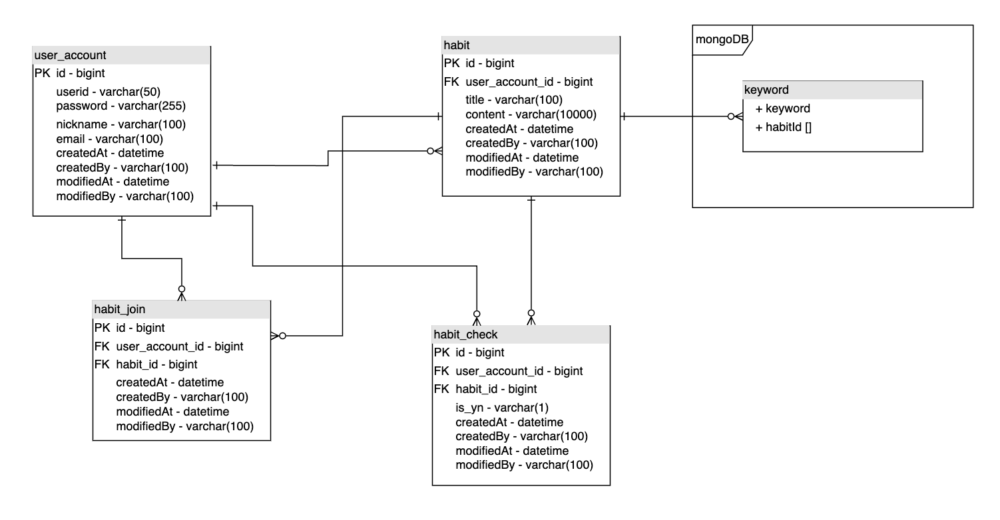

# 하루,한번 프로젝트
### 기능

---

- 매일 실천할 **습관**을 만들고, 여러 사람이 참여해서 매일 습관을 실천한다.
    - **습관 생성**: 여러 사용자가 참가할 수 있는 습관을 생성한다.
    - **습관 참여**: 만들어진 습관에 참여한다.
        - 참여한 습관을 탈퇴하거나, 조회할 수 있다.
    - **습관 실천**: 실천한 습관을 체크한다.
        - 습관은 각각 하루에 한번 실천여부를 체크 할 수 있다.
        - 매일 오전 4시 습관을 실천하지않은 사용자는 탈퇴된다.
- 습관을 제목으로 검색할 수 있다.
    - 검색시 역색인 구조로 습관 제목을 찾습니다.
    - 제목의 명사를 추출하여 keyword 테이블에 저장합니다.


## Project Structure

---

### 개발환경

- IntelliJ IDEA
- Java 17
- Gradle 7.4.1
- Spring Boot 2.6.7

### 기술스택

- Spring Boot
- Spring Data JPA
- MySQL
- H2 Database
- Lombok
- KOMORAN

### ERD

---



## 고도화

---

### **제목 검색 기능 향상 시키기**

> LIKE 로 검색하는 대신, keyword 테이블에서 조회하기
>


**LIKE 로 검색했을 때의 문제점.**

- **%산책하기** : 와일드카드가 앞에 붙었을 경우.
    - 인덱스를 걸어놔도 앞에 붙은 와일드카드때문에 fullscan 하게된다.
- **산책하기%** : 와일드카드가 뒤에 붙었을 경우.
    - **매일 산책**, **산책을 합시다** 같은 경우 검색이 되지않는다.

**키워드를 추출해서 검색을 성능을 높이기**

- 습관제목을 저장할 때, 형태소 분석기를 사용해 명사를 추출하여 저장한다.
    - 추출한 명사들을 keyword 테이블에 습관 id와 같이 저장한다.
- 검색시 검색어에서 명사를 추출해 keyword 테이블에서 조회한다.

## Trouble shooting

---

### **내부 메소드 호출시, 트랜잭션 미적용**

> @Transactional 없는 메소드에서, @Transactional 있는 내부 메소드 호출시 문제
>


**제목의 변경을 확인하고, update 를 위한 내부 메소드 호출시 트랜잭션이 열리지않는 문제**

- **Expect) update(트랜잭션X) -> 키워드Insert(트랜잭션 생성O)**
- **Actual) update(트랜잭션X) -> 키워드Insert(트랜잭션 생성X)**

**원인및 해결방법**

- @Transactionl 동작 방식때문에 생긴 문제
- 새로운 외부 클래스 keyword service 로 분리
---

### **Propagation.REQUIRES_NEW**

> 자식 트랜잭션 롤백시, 부모 트랜잭션도 같이 롤백되는 문제
>

```java
- 부모 트랜잭션 실행
- 자식 트랜잭션 실행(REQUIRES_NEW)
- 자식 트랜잭션 예외 발생
- 부모,자식 트랜잭션 둘 다 롤백
```

**keyword 저장에 예외가 발생하면, 습관도 생성되지않는 문제**

- propagation.REQUIRES_NEW 이 선언되어있지만 예외 발생시 둘다 롤백되는 문제를 발견했습니다.
- **Expect) 습관 생성 -> 키워드 생성(Exception)** : 습관 생성 O, 키워드는 생성 X
- **Actual) 습관 생성 -> 키워드 생성(Exception)** : 습관 생성 X, 키워드는 생성 X (둘 다 롤백)

**해결**

- **가정) 어떤 이유로 트랜잭션이 하나로 묶였다. (X)**
    - 각각 서로 다른 트랜잭션을 생성하는것을 확인.
    - 하지만 롤백될 때, 둘 다 롤백을 호출.

      

        - 습관생성 트랜잭션 (서로 다른 트랜잭션)

      

        - 키워드 생성 트랜잭션 (서로 다른 트랜잭션)

      

        - 롤백 될 때, 둘 다 롤백
- 로그를 확인해본 결과, **키워드생성 예외가 습관 생성메소드까지 전파** 된 걸 발견
    - 자식 트랜잭션 호출을 try-catch 로 감싼 뒤 정상적으로 동작을 확인.